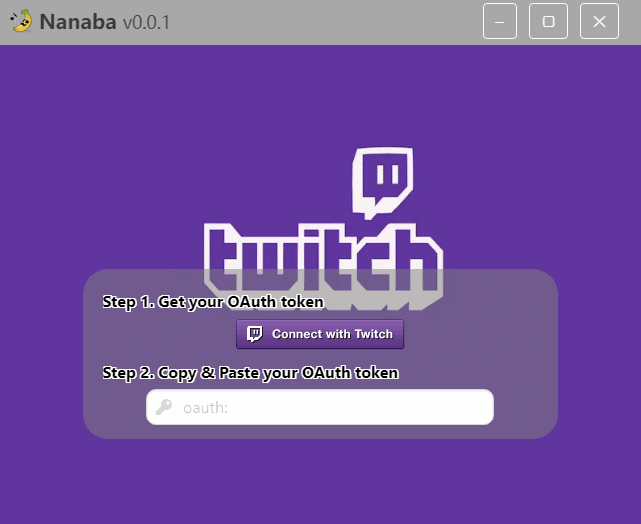
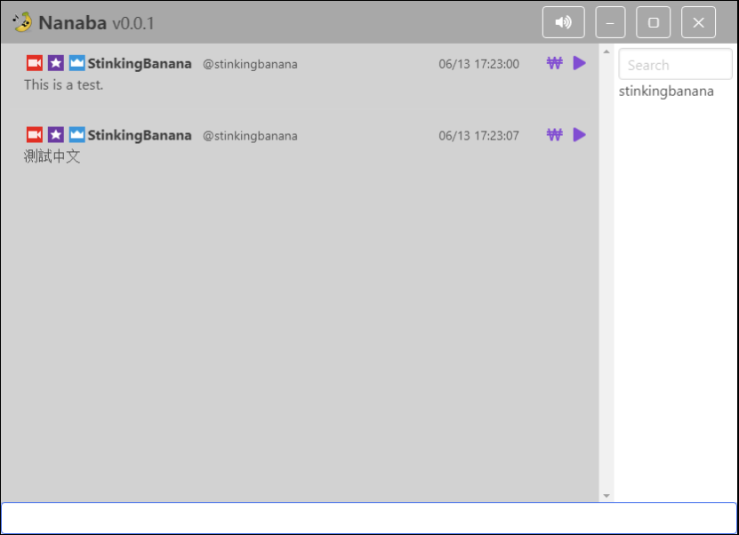

#  Nanaba
My weekend project: Chat room tool for twitch streamers.

## [Download | 下載](https://github.com/StinkingBanana/Nanaba/releases)

## Screenshots | 截圖

<br/>


## Status
Prototype. Working in progress. Use it at your own risk.

## To Run
1. NPM
```sh
  # Run Dev
  npm install
  npm run dev

  # Build 
  npm run build:dir
```

2. YARN
```sh
  # Run Dev
  yarn
  yarn dev

  # Build 
  yarn build:dir
```

## Tool used
- [electron](https://github.com/electron/electron)
- [electron-vue](https://github.com/SimulatedGREG/electron-vue)
- [vue](https://github.com/vuejs/vue)
- [vuex](https://github.com/vuejs/vuex)
- [vue-router](https://github.com/vuejs/vue-router)
- [vue-fontawesome](https://github.com/FortAwesome/vue-fontawesome)
- [vue-autofocus-directive](https://github.com/Botre/vue-autofocus-directive)
- [axios](https://github.com/axios/axios)
- [jsonfile](https://github.com/jprichardson/node-jsonfile)
- [bulma](https://bulma.io)
- [buefy](https://buefy.github.io/#/)
- [tmi.js](https://github.com/tmijs/tmi.js)
- [nedb](https://github.com/louischatriot/nedb)
- [momentjs](https://momentjs.com/)
- [vscode](https://code.visualstudio.com/)
- [simpleTTS](https://github.com/StinkingBanana/simpleTTS)
